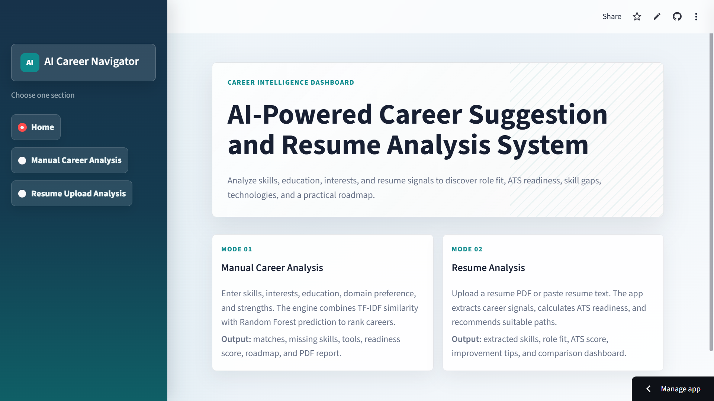
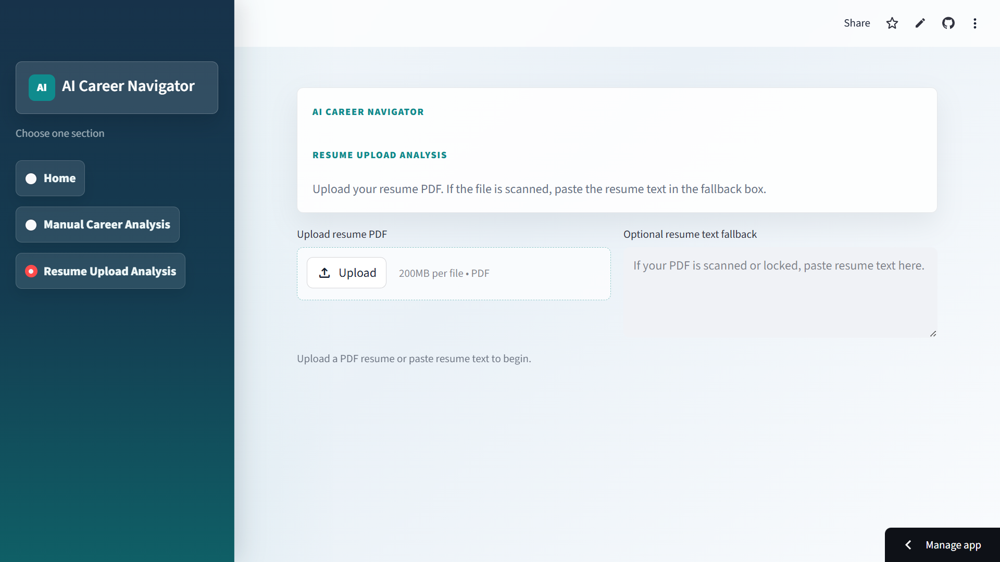
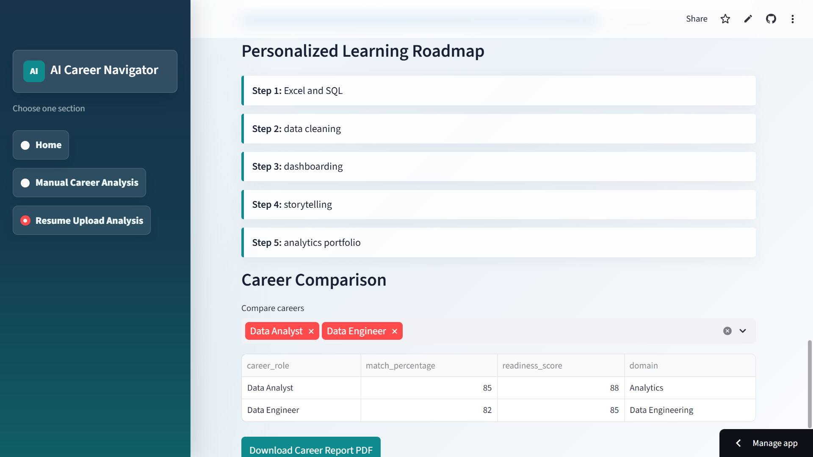

# AI-Powered Career Suggestion & Resume Analysis System


---

## Live Demo

[AI Career Navigator Live App](https://aiicareernavigator.streamlit.app/)

---

## Overview

This project is a professional AI-powered career guidance platform built using Python, Streamlit, Machine Learning, and NLP techniques.

The system helps users:
- Discover suitable career paths
- Analyze resumes
- Identify missing skills
- Calculate ATS scores
- Generate personalized learning roadmaps

Users can either manually enter their details or upload resumes for AI-based analysis and recommendations.

---

## Features

- Manual Career Analysis
- Resume Upload & Resume Parsing
- Career Prediction using Machine Learning
- ATS Resume Score Analysis
- Skill Gap Detection
- Personalized Learning Roadmap
- Career Match Percentage Visualization
- Interactive Dashboard with Plotly Charts
- Downloadable PDF Career Reports

---

## Machine Learning & NLP Concepts Used

| Technology | Purpose |
|------------|---------|
| Random Forest Classifier | Career Prediction |
| TF-IDF Vectorization | Skill Analysis |
| Cosine Similarity | Career Matching |
| NLP Resume Parsing | Skill Extraction |
| Recommendation Engine | Personalized Suggestions |

---

## Tech Stack

| Category | Technology |
|----------|------------|
| Frontend | Streamlit |
| Backend | Python |
| Machine Learning | Scikit-learn |
| Data Processing | Pandas, NumPy |
| Visualization | Plotly |
| Resume Parsing | PyPDF2, pdfplumber |

---

## Project Structure

```text
.
├── app.py
├── train_model.py
├── requirements.txt
├── datasets/
├── models/
├── preprocessing/
├── utils/
├── frontend/
├── screenshots/
└── assets/
```

---

## Application Screenshots

### Homepage

```markdown

```

### Resume Analysis Dashboard

```markdown

```

### Career Recommendation Dashboard

```markdown

```

### Learning Roadmap Section

```markdown

```

---

## Run Locally

```bash
pip install -r requirements.txt
python train_model.py
streamlit run app.py
```

---

## Project Workflow

```text
User Input / Resume Upload
        ↓
Resume Parsing & Skill Extraction
        ↓
ML Career Prediction
        ↓
Skill Gap Analysis
        ↓
Career Recommendations & Roadmap
```

---

## Future Enhancements

- Real-time Job Market API Integration
- AI Career Chatbot Assistant
- LinkedIn Profile Analysis
- Interview Preparation Recommendations
- Salary Prediction System
- User Authentication & Saved Profiles
- Course & Certification Recommendation System
- Real-time Trending Skills Dashboard
